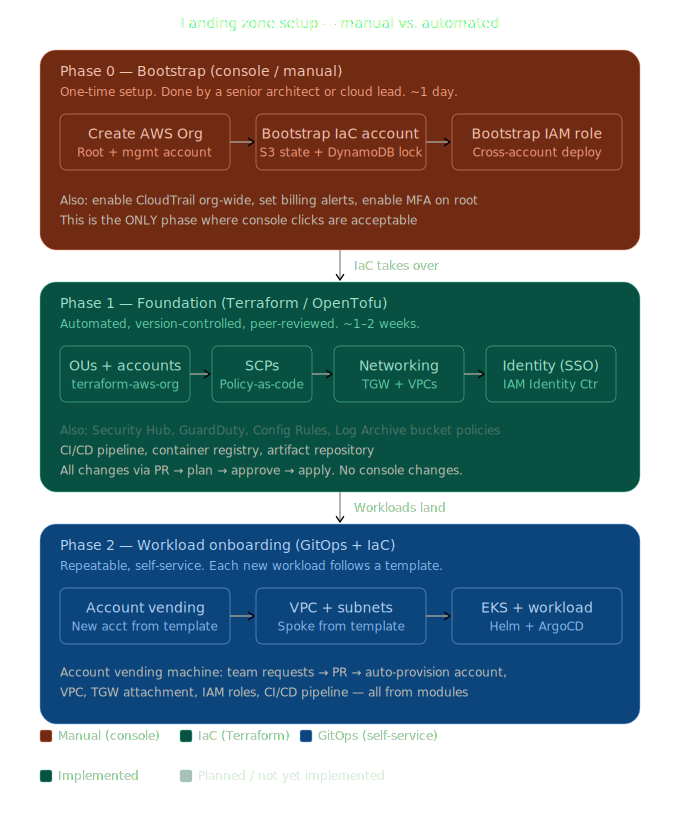
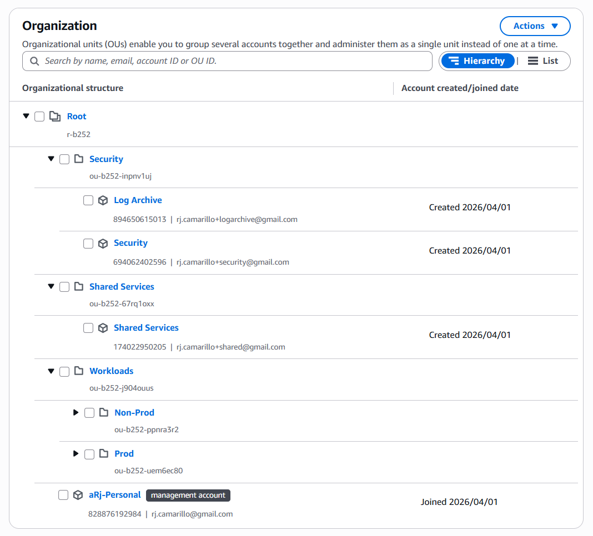
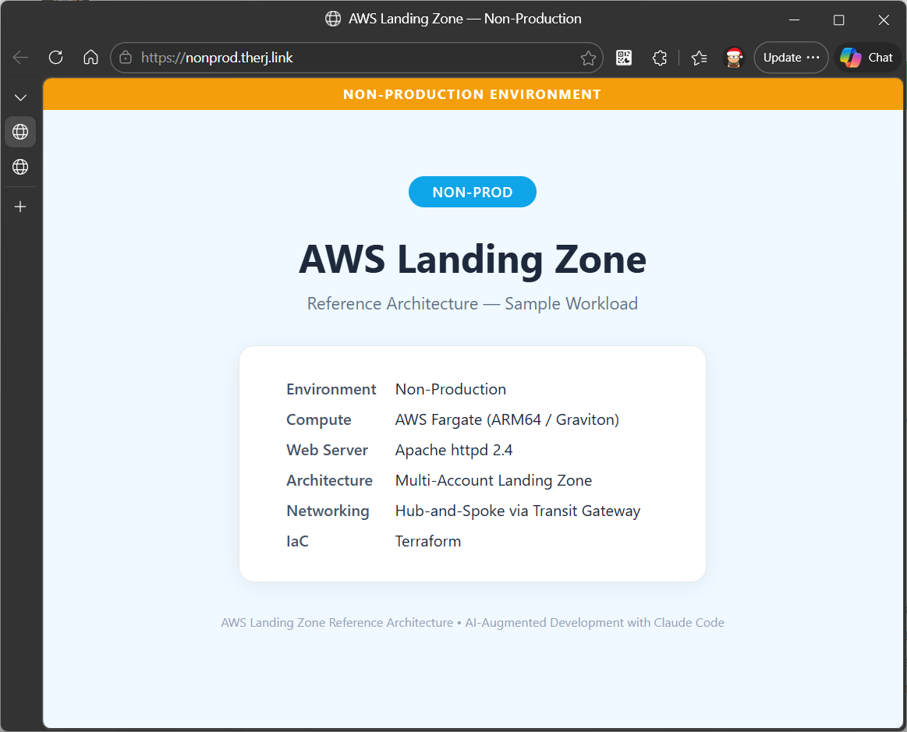
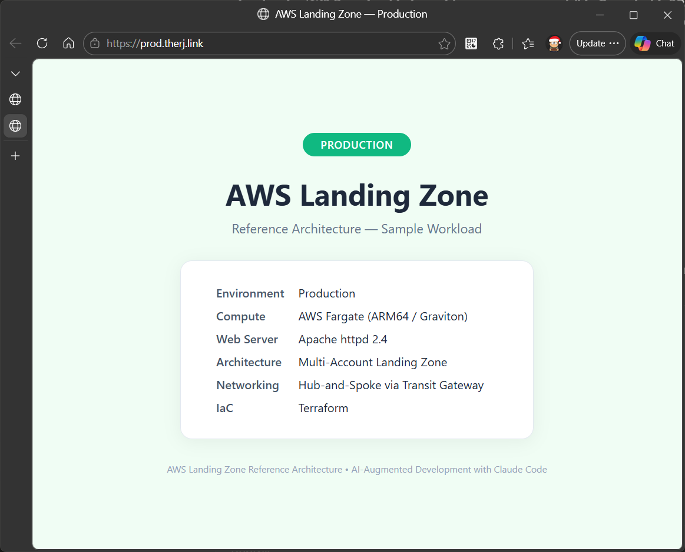
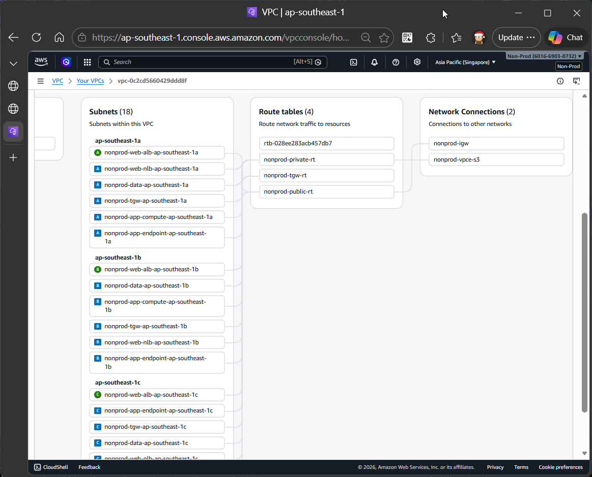
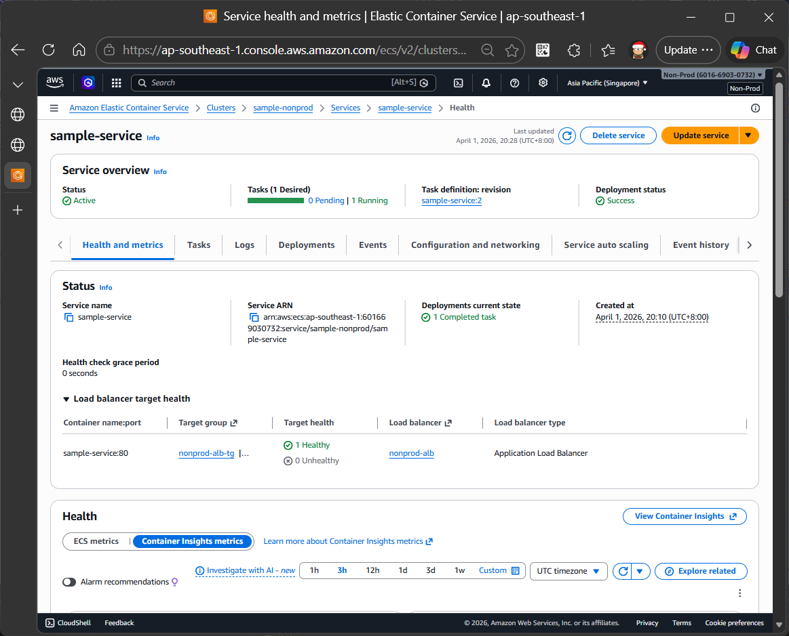
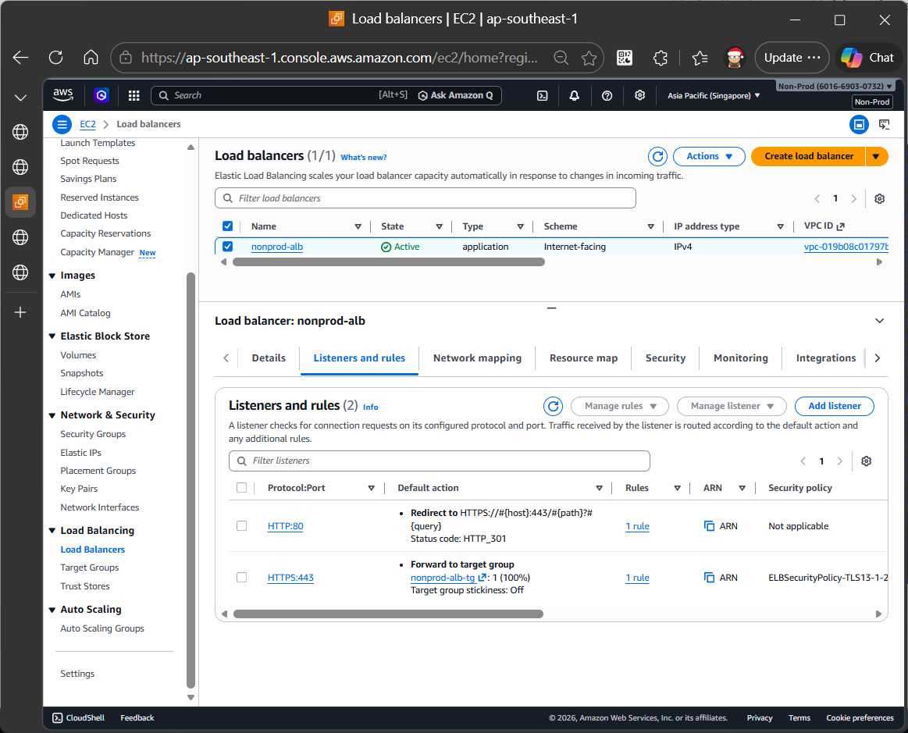

# AWS Landing Zone Reference Architecture

Multi-account AWS Landing Zone reference implementation showcasing cloud governance at scale. Provisions 5 accounts (Management, Security, Log Archive, Shared Services, Non-Prod, Prod) with preventive guardrails (SCPs), hub-and-spoke networking (Transit Gateway), centralised identity (IAM Identity Center), immutable logging, and sample workloads on ECS Fargate ARM64/Graviton. All infrastructure defined as Terraform IaC. Built using AI-augmented development with Claude Code.

---

## Architecture Overview



### Setup Phases



For detailed architecture decisions, trade-offs, and AWS-to-Azure equivalences,
see [ARCHITECTURE.md](ARCHITECTURE.md) (9 ADRs covering multi-account strategy,
networking, VPC microsegmentation, VPC endpoints, SCPs, OIDC, and Terraform design).

---

## Prerequisites

### Tools

- **Terraform** >= 1.5
- **AWS CLI** v2
- **Docker** with Buildx (for building ARM64 container images)

### AWS manual setup (one-time, before running any Terraform)

These steps cannot be fully automated and must be completed via the AWS Console
or CLI. See [`foundation/00-bootstrap/README.md`](foundation/00-bootstrap/README.md)
for the full checklist.

1. **AWS Organizations** — Enable "All features" on the management account
2. **S3 state bucket** — Create `rj-landing-zone-tfstate` (ap-southeast-1,
   versioning enabled, public access blocked)
3. **DynamoDB lock table** — Create `rj-landing-zone-tflock` (PAY_PER_REQUEST)
4. **IAM Identity Center** — Enable via AWS Console → IAM Identity Center →
   "Enable with AWS Organizations" (this **cannot** be done via CLI/API for
   the management account — AWS requires Console enablement)
5. **RAM sharing with Organizations** — Enable via CLI (required for Transit
   Gateway sharing across accounts):
   ```bash
   aws ram enable-sharing-with-aws-organization --region ap-southeast-1
   ```
6. **Root MFA** — Enable MFA on the management account root user
7. **Route 53 hosted zone** — `therj.link` must exist (or update variables
   for your domain)

> **Note:** The provisioning scripts automatically extract account IDs from
> `foundation/01-organization` outputs — no manual account ID configuration
> is needed. SCP policy type enablement and CloudTrail are managed by Terraform.

---

## Quick Start

1. **Clone the repository**

   ```bash
   git clone https://github.com/rj-cam/agentic-landing-zone.git
   cd agentic-landing-zone
   ```

2. **Configure AWS credentials for the management account**

   ```bash
   aws configure --profile management
   export AWS_PROFILE=management
   ```

3. **Provision the foundation layers**

   Account IDs are auto-extracted from `01-organization` outputs and passed
   to downstream layers — no manual variable configuration needed.

   ```bash
   ./scripts/provision-foundation.sh       # Linux/macOS
   scripts\provision-foundation.bat        # Windows
   ```

4. **Build and push the Docker image to ECR**

   ```bash
   aws ecr get-login-password --region ap-southeast-1 | docker login --username AWS --password-stdin <shared-services-account-id>.dkr.ecr.ap-southeast-1.amazonaws.com

   docker buildx build --platform linux/arm64 --push \
     -t <shared-services-account-id>.dkr.ecr.ap-southeast-1.amazonaws.com/landing-zone/httpd:latest \
     ./sample-workload
   ```

5. **Provision the workload layers**

   ```bash
   ./scripts/provision-workloads.sh        # Linux/macOS
   ./scripts/provision-workloads.bat       # Windows
   ```

6. **Verify the deployment**

   ```bash
   curl https://nonprod.therj.link
   curl https://prod.therj.link
   ```

---

## Teardown

- **Workloads only:**

  ```bash
  ./scripts/teardown-workloads.sh
  ```

- **Full teardown:** Destroy workloads first, then foundation layers in reverse order (06 -> 01):

  ```bash
  ./scripts/teardown-workloads.sh

  cd foundation/06-shared-services && terraform destroy -auto-approve && cd ../..
  cd foundation/05-networking      && terraform destroy -auto-approve && cd ../..
  cd foundation/04-logging         && terraform destroy -auto-approve && cd ../..
  cd foundation/03-identity-center && terraform destroy -auto-approve && cd ../..
  cd foundation/02-scps            && terraform destroy -auto-approve && cd ../..
  cd foundation/01-organization    && terraform destroy -auto-approve && cd ../..
  ```

> **Warning:** Never destroy `01-organization` before all other layers have been torn down. The organization layer owns the OUs and accounts that all other layers reference. Destroying it first will leave orphaned resources and broken remote state references.

---

## Project Structure

```
agentic-landing-zone/
├── .github/
│   └── workflows/
│       └── deploy.yml                  # CI/CD: build ARM64 image, deploy nonprod, then prod
├── sample-workload/
│   ├── Dockerfile                      # httpd on ARM64 with environment-aware entrypoint
│   ├── entrypoint.sh                   # Copies the correct page based on ENVIRONMENT var
│   └── pages/
│       ├── nonprod.html                # Non-Prod landing page
│       └── prod.html                   # Production landing page
├── foundation/
│   ├── 00-bootstrap/
│   │   ├── bootstrap.sh                # Creates S3 backend + DynamoDB lock table
│   │   ├── bootstrap.bat               # Windows equivalent
│   │   ├── README.md                   # Bootstrap instructions
│   │   └── BOOTSTRAP_LOG.md            # Execution log
│   ├── 01-organization/
│   │   ├── main.tf                     # AWS Organizations, OUs, member accounts
│   │   ├── variables.tf                # Account emails, org unit names
│   │   ├── outputs.tf                  # OU IDs, account IDs for downstream layers
│   │   ├── providers.tf                # AWS provider config
│   │   ├── backend.tf                  # S3 remote state config
│   │   └── README.md
│   ├── 02-scps/
│   │   ├── main.tf                     # Remote state references, locals
│   │   ├── deny-root.tf                # Deny root user actions in member accounts
│   │   ├── region-restrict.tf          # Restrict to ap-southeast-1 + us-east-1
│   │   ├── require-s3-encryption.tf    # Enforce S3 server-side encryption + HTTPS
│   │   ├── require-ebs-encryption.tf   # Enforce EBS volume encryption
│   │   ├── protect-log-archive.tf      # Immutable log archive bucket protection
│   │   ├── require-prod-tagging.tf     # Mandatory tags in production
│   │   ├── variables.tf / outputs.tf / providers.tf / backend.tf
│   │   └── README.md
│   ├── 03-identity-center/
│   │   ├── main.tf                     # IAM Identity Center, permission sets, assignments
│   │   ├── variables.tf / outputs.tf / providers.tf / backend.tf
│   │   └── README.md
│   ├── 04-logging/
│   │   ├── main.tf                     # CloudTrail org trail, S3 log archive bucket
│   │   ├── variables.tf / outputs.tf / providers.tf / backend.tf
│   │   └── README.md
│   ├── 05-networking/
│   │   ├── main.tf                     # VPCs for workload accounts
│   │   ├── transit-gateway.tf          # Transit Gateway hub in Shared Services
│   │   ├── dns-role.tf                 # Cross-account Route 53 DNS role
│   │   ├── variables.tf / outputs.tf / providers.tf / backend.tf
│   │   └── README.md
│   └── 06-shared-services/
│       ├── main.tf                     # Shared Services account resources
│       ├── ecr.tf                      # ECR repository for container images
│       ├── github-oidc.tf              # GitHub Actions OIDC provider + IAM roles
│       ├── variables.tf / outputs.tf / providers.tf / backend.tf
│       └── README.md
├── modules/
│   ├── alb/                            # Application Load Balancer module
│   │   ├── main.tf / variables.tf / outputs.tf
│   ├── dns-record/                     # Route 53 DNS record module
│   │   ├── main.tf / variables.tf / outputs.tf
│   ├── ecs-fargate-service/            # ECS Fargate service + task definition module
│   │   ├── main.tf / variables.tf / outputs.tf
│   ├── scp-policy/                     # Reusable SCP policy + attachment module
│   │   ├── main.tf / variables.tf / outputs.tf
│   └── vpc/                            # VPC with public/private subnets, NAT Gateway
│       ├── main.tf / variables.tf / outputs.tf
├── scripts/
│   ├── provision-foundation.sh         # Provision all foundation layers in order
│   ├── provision-foundation.bat        # Windows equivalent
│   ├── provision-workloads.sh          # Provision workload layers
│   ├── provision-workloads.bat         # Windows equivalent
│   ├── teardown-workloads.sh           # Destroy workload layers in reverse
│   └── teardown-workloads.bat          # Windows equivalent
├── workloads/
│   ├── 01-nonprod/
│   │   ├── main.tf                     # Non-Prod ECS Fargate, ALB, DNS
│   │   ├── variables.tf / outputs.tf / providers.tf / backend.tf
│   │   └── README.md
│   └── 02-prod/
│       ├── main.tf                     # Production ECS Fargate, ALB, DNS
│       ├── variables.tf / outputs.tf / providers.tf / backend.tf
│       └── README.md
├── docs/
│   ├── aws_lz_reference_architecture.svg  # Architecture diagram
│   └── aws_lz_setup_phases.svg            # Phase 0/1/2 setup flow
├── ARCHITECTURE.md                     # Architecture Decision Records (9 ADRs)
├── CLAUDE_CODE_LOG.md                  # AI-augmented development log + lessons learned
├── .gitignore
└── README.md                           # This file
```

---

## Governance Model

Six Service Control Policies enforce preventive guardrails across the organization:

| SCP | Target | What It Prevents |
|-----|--------|------------------|
| `region-restrict` | Root OU | Actions outside `ap-southeast-1` and `us-east-1` (global services exempted: IAM, Organizations, STS, CloudFront, Route 53, Support, Budgets, WAF, CloudWatch) |
| `deny-root` | Root OU | All actions by the root user in any member account |
| `require-s3-encryption` | Root OU | S3 PutObject without server-side encryption (AES256/aws:kms) and non-HTTPS S3 requests |
| `require-ebs-encryption` | Root OU | Launching EC2 instances with unencrypted EBS volumes |
| `protect-log-archive` | Log Archive Account | Deletion of the centralised Log Archive S3 bucket and its objects |
| `require-prod-tagging` | Prod OU | Resource creation without `Environment`, `Owner`, and `CostCenter` tags |

**Preventive vs Detective controls:** SCPs are *preventive* -- they stop non-compliant actions before they happen. No non-compliant resource ever exists. Detective controls (AWS Config Rules, Security Hub) complement this by auditing existing state and detecting drift. This implementation prioritises preventive controls; detective controls are recommended as a production enhancement.

### Additional Security Hardening

| Control | Scope | What It Does |
|---------|-------|-------------|
| S3 deny HTTP | State bucket + Log Archive | Rejects any S3 request not using TLS |
| ECS exec disabled | All ECS services | Prevents interactive shell access to running containers |
| Default EBS encryption | Shared Services, Non-Prod, Prod | All new EBS volumes encrypted by default (account-level) |
| TLS 1.3 on ALBs | All internet-facing ALBs | Enforces modern TLS with HTTP→HTTPS redirect (ADR-010) |
| IMDSv2 enforcement | Root OU (SCP) | Blocks EC2 instances without IMDSv2 token requirement |
| No NAT Gateway | All workload VPCs | Private subnets have no internet route — AWS access via VPC Endpoints only (ADR-008) |

---

## Networking

The networking layer implements a **hub-and-spoke** topology with **5-tier VPC microsegmentation** (ADR-009):

- **Hub:** Transit Gateway (TGW) in the Shared Services account, shared via RAM.
- **Spokes:** Each workload VPC uses dual CIDRs (/24 infra + /21 workloads) with 18 subnets across 3 AZs.
- **Subnet tiers:** TGW (/28) → Web ALB (/27, public) → App Endpoint (/27, VPC endpoints) → App Compute (/23, ECS tasks) → Data (/27, reserved for RDS). Traffic flow enforced by NACLs.
- **No NAT Gateway:** All AWS service access via VPC Endpoints (ADR-008) — ECR, ECS, CloudWatch Logs, STS, S3. Traffic stays on the AWS backbone.
- **HTTPS:** ALBs terminate TLS 1.3 (ADR-010) with ACM certificates. HTTP redirects to HTTPS.
- **DNS:** Route 53 in the Management account with cross-account IAM role for workload DNS records (`nonprod.therj.link`, `prod.therj.link`).

---

## CI/CD Pipeline

The GitHub Actions workflow (`.github/workflows/deploy.yml`) implements a progressive delivery pipeline:

1. **Build:** Builds an ARM64 Docker image using `docker buildx` with QEMU emulation.
2. **Push:** Authenticates to ECR in the Shared Services account via OIDC and pushes the image tagged with the commit SHA.
3. **Deploy Non-Prod:** Assumes an OIDC role in the Non-Prod account, updates the ECS task definition with the new image, and deploys. Waits for service stability.
4. **Manual Approval:** The `production` environment in GitHub requires manual approval before the production deployment proceeds.
5. **Deploy Prod:** Same pattern as Non-Prod, targeting the Prod account and cluster.

**Security:** All AWS authentication uses GitHub Actions OIDC federation -- no long-lived access keys are stored as secrets. Roles are scoped to specific repositories via OIDC subject conditions. Credentials are short-lived (~1 hour) and auditable via CloudTrail.

---

## AI-Augmented Development

This project was generated using **Claude Code** (Anthropic). The entire IaC scaffold -- Terraform modules, foundation layers, workload layers, CI/CD pipeline, documentation, and Architecture Decision Records -- was generated from a specification document through iterative AI-augmented development.

See [`CLAUDE_CODE_LOG.md`](CLAUDE_CODE_LOG.md) for the full development log, including the prompts used, decisions made, and the sequence of generation.

---

## Screenshots & Demos

### AWS Organizations Hierarchy



5 OUs, 5 member accounts, all managed by Terraform.

### Sample Workload — Non-Production



httpd on ECS Fargate ARM64/Graviton, served over HTTPS with TLS 1.3.

### Sample Workload — Production



Same architecture, different environment badge. 2 tasks for HA.

### VPC Microsegmentation (Non-Prod)



5-tier subnet architecture: TGW, Web ALB, Web NLB, App Endpoint, App Compute, Data — across 3 AZs with dual CIDRs (/24 + /21).

### ECS Fargate Service



ARM64/Graviton tasks running in the app compute tier with VPC endpoint connectivity.

### Application Load Balancer



HTTPS listener with TLS 1.3, HTTP→HTTPS redirect, health checks on the web ALB tier.

### Provision & Teardown Timelapses

Workload provisioning (40x speed — ~5 min real time):

https://github.com/user-attachments/assets/provision-workloads

> See [`docs/10-provision-workloads-40x.mp4`](docs/10-provision-workloads-40x.mp4)

Workload teardown (40x speed — ~5 min real time):

> See [`docs/11-teardown-workloads-40x.mp4`](docs/11-teardown-workloads-40x.mp4)

---

## Production Considerations

The following enhancements are recommended before using this reference architecture for production workloads:

- **Security Hub** -- Enable across all accounts for continuous compliance posture assessment (CIS, PCI-DSS, AWS Foundational benchmarks). Free 30-day trial.
- **GuardDuty** -- Enable for intelligent threat detection across accounts (anomalous API calls, compromised credentials, cryptocurrency mining). Free 30-day trial.
- **AWS Config Rules** -- Deploy detective controls to complement SCPs (detect drift, audit resource configurations)
- **AWS WAF** -- Attach Web Application Firewall rules to ALBs for OWASP Top 10 protection, rate limiting, and geo-blocking
- **Account vending machine** -- Automate new account creation with pre-configured guardrails using AWS Control Tower or a custom Terraform pipeline
- **Break-glass IAM user** -- Create an emergency access path that bypasses Identity Center for disaster recovery scenarios
- **SAML/OIDC federation** -- Integrate IAM Identity Center with your corporate identity provider (Okta, Azure AD/Entra ID, Ping)
- **SSM VPC Endpoints** -- Add `ssm`, `ssmmessages`, `ec2messages` endpoints when introducing EC2 instances for Systems Manager patching
- **VPC Flow Logs** -- Enable flow logs on all VPCs and deliver to the centralised Log Archive for network forensics
- **ArgoCD or Flux** -- Replace ECS with EKS and adopt GitOps-based continuous delivery for Kubernetes workloads
- **Multi-region DR** -- Replicate critical infrastructure (S3, DynamoDB state) to a secondary region for disaster recovery
- **FinOps** -- Enable Cost Explorer, evaluate Savings Plans / Reserved Instances for steady-state workloads, enforce cost allocation tags via SCPs

**Already implemented in this reference:** HTTPS with TLS 1.3 (ADR-010), VPC Endpoints replacing NAT Gateway (ADR-008), VPC microsegmentation with NACLs (ADR-009), S3 deny-HTTP policy, ECS exec disabled, default EBS encryption, 6 SCPs, cross-account OIDC CI/CD.

---

## AWS to Azure Equivalence

For teams evaluating multi-cloud strategies, the following table maps each AWS capability used in this implementation to its Azure equivalent:

| Capability | AWS (this implementation) | Azure Equivalent |
|------------|--------------------------|------------------|
| Multi-account governance | Organizations + OUs | Management Groups |
| Preventive guardrails | Service Control Policies | Azure Policy (Deny effect) |
| Account/subscription vending | Organizations API | Subscription vending (Bicep/Terraform) |
| Centralised identity | IAM Identity Center | Entra ID (Azure AD) |
| Hub-and-spoke networking | Transit Gateway | Azure Virtual WAN / VNet peering |
| Container registry | ECR | Azure Container Registry |
| Container compute | ECS Fargate | Azure Container Instances / AKS |
| ARM64 compute | Graviton (ARM64) | Ampere Altra (ARM64) VMs |
| Load balancing | ALB | Azure Application Gateway |
| DNS | Route 53 | Azure DNS |
| IaC state | S3 + DynamoDB | Azure Storage Account + Blob lease |
| CI/CD identity | GitHub Actions OIDC | GitHub Actions OIDC (identical) |
| Logging | CloudTrail | Azure Activity Log |
| Security posture | Security Hub + GuardDuty | Defender for Cloud + Sentinel |
| Policy-as-code | SCPs + Config Rules | Azure Policy + Blueprints |
